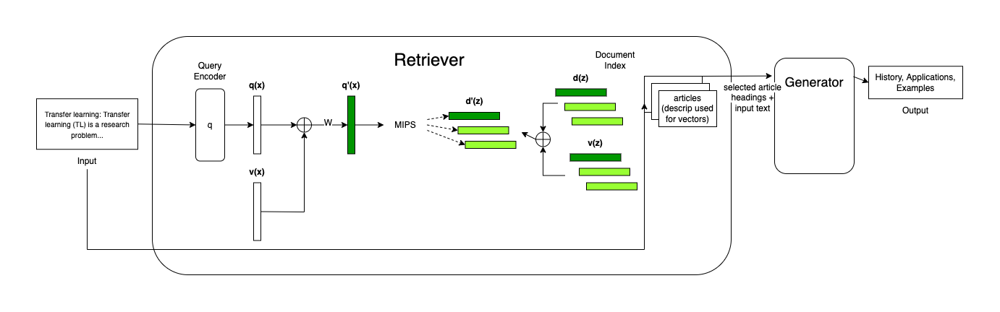

# Introduction

In this work, we tackle the task of outline generation for articles using a modified version of the Retrieval Augmented Generation framework [[1]](#1). We formulate our task as follows: given some knowledge base of existing Wikipedia documents, and a text input of the form

`<topic>: <description about topic>`

we generate a list of possible subheadings (e.g. "Applications, History, Types") as the output for an article about this topic.

# Related work

Liu et al. [[4]](#4) try to directly generate entire wikipedia articles by framing the task as a sequence-to-sequence multi-document summarization task. Wikipedia articles are use as training data. The input documents for each article is the text of all the referenced works, and the target sequence is the article itself. This work uses an efficient variant of a transformer paired with some coarse selection techniques to account for the large size of the input and output text.

Sauper et al. [[5]](#5) generate structured articles by generating a universal template (i.e. list of common subheadings) for articles within a certain topic (e.g. "diseases") and jointly try to populate content for each subheading in the template using a perceptron algorithm & ILP formation.

Zhang et al. [[6]](#6) propose the task of outline generation, which tries to generate an outline summary for any long document. The authors use a Markov dependency mechanism to first predict section boundries and then a corresponding heading for each section from the input article.

Yao et al. [[7]](#7) develop a story-generation model with improved coherence using a <i>plan-and-write</i> hierarchical generation framework: the model first generates a storyline and then writes a more detailed story using that storyline.

Banerjee et al. [[8]](#8) attempt to automatically generate Wikipedia articles by using vector representation of entities within articles to identify similar articles. Using these similar articles, the model scrapes and organizes web content into sections using ILP-based abstractive summarization.

Drissi et al. [[9]](#9) attempt to improve the coherence of large outputs from nerual-based text generation models by first generating an outline to keep the model focused. The models start by generating topic sentences for the article, and then they expand each sentence to a full paragraph. The generators are based off of a convolutional sequence-to-sequence model.

Zhu et al. [[10]](#10) tackle generating the abstract of a Wikipedia article using a topic-aware multi-document summarization approach. Each input document for an article is divided into different topic, and this distribution is used conditionally to generate a Wikipedia abstract for that article.

Hua et al. [[11]](#11) enhance the coherence of Transformer-based text generators using content plans and iterative refinement: the content plan consists ofkeyphrases assigned to sentence-level positions through a sequence-to-sequence task learner, and then this content plan is iteratively refined (i.e. expanded) using BART.

# Architecture

## Baseline

As a baseline for this task, we finetune a T5 model to learn the task of generating subheadings for an article directly as a sequence-to-sequence task: given the text input of an article's title and short intro description about the article, directly generate section headings.

This baseline formulation is a fairly direct NLP solution to the task of outline formulation we introduced earlier in this paper.

## Proposed Architecture

We chose to use a modified version of the RAG (Retrieval Augmented Generation) architecture. The main intuition behind RAG is to augment an input sequence with relevant context text from some knowledge base of documents and then train a generator to convert from this augmented input sequence to the desired output (i.e. the subheadings).


As shown in the above picture from the original RAG paper [[1]](#1), the main components of the RAG architecture are the retreiver and the generator. The retriever is derived from DPR. In the retriever, $q(x)$ represents the query vector (used to query context documents during DPR) and $d(z)$ represents the context vector (representations for retrieval units). In the original paper, $q(z)$ and $d(z)$ are both pre-trained $\text{BERT}_{\text{BASE}}$ models [[12]](#12), and the seq2seq conditional generator model is BART. 

We base our model off of the RAG-Token variant. Our main modifications are centered around the retriever. We leave the generator architecture unchanged. Specifically, for the retriever, we augment $q(x)$ and $d(z)$ by concatenating an additional feature vector $v(x)$ (e.g. $v(x)$ can be a word2vec representation). We add an additional fully connected layer on $q(x)$ after augmenting it so that the query vector size can always be made to match the context vector for DPR.

Mathematically,

- $q'(x) = W \times (q(x) \bigoplus v(x))$
- $d'(z) = d(z) \bigoplus v(z)$

where $W$ is a learnable parameter, $v(x)$ is some additional features of $x$, and $\bigoplus$ is the vector concatenation operator. Note that $v(x)$ isn't limited to the text of the article $x$. It could rely on additional meta data about the article (e.g. graphical embedding of the article).




Additionally, unlike in the original RAG architecture, the text that is used to generate the representation of our context documents, $q(x)$, is different from the text that is passed down as input to the generator component. In the original RAG architecture and DPR works, the text used to generate the representation of documents and the text passed down as input to the generator component were the same.

By formatting our architecture this way, we are forcing the Retreiver part of our architecture to learn to fetch similar / relevant documents, and the generator to create a summarized outline from the outlines of several similar documents.

In a sense, this is like a learnable kNN model: the retriever learns to fetch similar documents based on some query embedding in a similar space (like fetching nearest neighbors), and the generator takes the outlines from these neighbors to generate the output (comporable to how the output is generated by looking at nearest-neighbors in kNN).

## Rationale

The reason for including an additional word2vec representation in addition to the BERT representation is to provide a more global, domain-centric representation of the feature / article we are trying to summarize. Without the additional query representation, we are limited to whatever pre-trained representation BERT had in the question encoder when determining similarity between documents. 

There may be many instances where we want to augment a pre-trained representation with a more task-specific, focused one, and this architecture attempts to incorporate such representations into the RAG architecture. In particular, we focus on improving the retrieval component of the architecture, which is usually not a target for improvement by most other works.

As we trained our word2vec encapsulates distributional similarity, and we trained our model on a specific subset of papers, we may be able to provide additional, useful context to the retriver when retrieving similar documents. 

As both the retriver and generator are connected end-to-end, the retriver can tweak its similarity metric using loss from the generator during training.

## Implementation

We use huggingface's PyTorch implementation of RAG and its associated training scripts as our starting point.


# Data Collection

Our training data consisted of wikipedia articles related to Computer Science. In practice, the training articles can be on arbitrary topics. For each article, we collected

- Article title
- Article abstract
- Top level subheadings

The top level subheadings would be the article's target sequence.

Articles were filtered by by obtaining a list of Computer Science keywords (mined from places such as arXiV and Springer), and checking whether there was a Wikipedia article corresponding to that keyword.

Out of around 18,000 computer science wikipedia articles, 40% were used to populate the knowledge base. The reamining 60% were split in a 80-18-2 ratio for train-test-val data for training the actual RAG architecture.

# Training

For our additional representation $v(x)$, we used a word2vec [[2]](#2) model (trained by Edward Ma). Note that we only used the title of each article (corresponding to some computer science keyword) to look up the corresponding vector representation to get $v(x)$.

Like the orignal RAG architecture, we keep the context representations fixed and finetune the question encoder as well as $W$ from the above equations. Training was done using the Adam optimizer.

# Results

In order to compare the generated subheadings with the ground truth subheadings, we used standard precision and recall metrics. Specifically, for a single article, we define

- $Prec = \frac {\text{num of intersecting headings}} {num of generated headings}$

- $Recall = \frac {\text{num of intersecting headings}} {\text{num of ground truth headings}}$

It is quite easy to generate metrics for an entire testing dataset by summing up the quantities over all articles in the set and taking the appropriate ratios. For initial experiments, two subheadings were considered to match if they matched exactly.

<div style="display:flex">
     <div style="flex:1;">
          
     </div>
     <div style="flex:1;">
          
     </div>
     <div style="flex:1;">
          
     </div>
</div>

Note: the hyper-parameters word2vec-augmented model has not been tweaked yet for best performance (in terms of decoding method and learning rate) as the other two baseline models have. We also significantly restricted the input article description length when training the word2vec model because the generator was excessively relying on the input text and not the retrieved documents' texts when generating outline.

For ablation analysis, we also trained a model where only the modification of using different texts for representation and generator input in the encoding during the retrieval step was implemented.

Since there was a variability between articles, and our exact-match criteria might be considered to restrictive (e.g. "Applications" would not match "Uses and Apllications"), precision and recall for our models was quite low . For future work, a possible way to make the comparison more relaxed is to somehow group all similar headings and classify headings as matching if they belong in the same group.

## Analysis

To understand the results a bit better, the most frequent correctly and incorrectly headings were also generated. For the word2vec-augmented model, the results were:

```
Analysis over 1729 examples
         Most common sections:
          > ('History', 349)
          > ('Examples', 103)
          > ('Applications', 79)
          > ('Definition', 62)
          > ('Properties', 20)
          > ('Types', 15)


         Most missed sections:
          > ('Overview', 76)
          > ('Applications', 69)
          > ('Types', 61)
          > ('Definition', 60)
          > ('Other uses', 59)
          > ('History', 57)


         Most extra sections:
          > ('History', 989)
          > ('Examples', 460)
          > ('Applications', 446)
          > ('Definition', 258)
          > ('History,', 208)
          > ('Types', 113)
```

where "most common" indicates correctly predicted headings, "most missed" indicates headings present in the ground truth, but not in the generated outline, and "mosts extra" indicates headings present in the generated outlines, but not in the ground truth. These statistics were very similar to the RAG baseline model:

```
Analysis over 1979 examples
         Most common sections:
          > ('History', 366)
          > ('Definition', 82)
          > ('Applications', 76)
          > ('Examples', 70)
          > ('Other uses', 55)
          > ('Etymology', 40)


         Most missed sections:
          > ('History', 124)
          > ('Overview', 93)
          > ('Applications', 86)
          > ('Examples', 65)
          > ('Types', 64)
          > ('Sources', 52)


         Most extra sections:
          > ('History', 648)
          > ('Definition', 321)
          > ('Applications', 316)
          > ('Examples', 230)
          > ('Etymology', 209)
          > ('Properties', 127)
```

Most of the error rates seem to be coming from the failure to correctly assign general headings for each article. Often times, the most correctly predicted section also appears on the "most missed" or "most extra" error sections.

From a qualitative perspective, many of the orignial Wikipedia article headings were non-uniform quite poor. The RAG models tended to produce more general and complete heading outlines.

The word2vec-augmented model tended to produce much more generalized headings compared to the other models. However, it tended produce fewer headings per outline as well.

## Examples

Below are sample outlines generated by some of the models. The format is `<article title>: <headings>`. Duplicated headings within outlines have been eliminated for readability.

Sample outlines from the T5 baseline model:
* Network forensics: History, Types of network forensics, Areas of research
* Null set: Definition, Examples, Null sets of -numbers
* Bernoulli scheme: Definition, Examples, Properties, Generalizations
* Runtime verification: Overview, Algorithms, Examples
* Homotopy: Definition, Examples, Homotopy vs. homotopy, Cohomogeneous functions

Sample outlines from the RAG baseline model:
* hilbert function: Definition, Examples, Properties
* maximum clique problem: Problem formulation, Algorithms for solving the problem
* simplex method: History, Algorithm, Applications
* binary search tree: History, Types of binary search trees, Applications
* data compression: Compression algorithms, Lossless vs. lossy compression

Sample outlines from the RAG word2vec model:
* anomaly detection: Definition, Applications, Examples
* polynomial kernel: Definition, Examples
* part-of-speech tagging: History, Types, Types of tagging
* lattice-based cryptography: History, Examples
* partial k-tree: Definition, Examples

# Pending work / Known Issues

- Model were trained and evaluated over different size and quality data sets. For better result comparison, use same training / eval data.

- Use a special character seperator (e.g. [SEP]) instead of commas to seperate between model headings during model training and inference.

- Difference between the article description lengths between the models (some were only trained with one sentence input, others had a whole paragraph)

- Experiment with using Wikipedia2Vec [[3]](#3) as $v(x)$

- Use approximate matching when comparing generated subheadings to ground-truth subheadings

- Last trained model produces repetitve results (i.e. the same heading is outputted multiple times within the same outline). Need to tweak learning rate / decoding method.

- There was a second variant for extending the RAG that was never implemented / tested out. The main difference between this variant and the first variant was to pass in the word2vec embedding as the first token in the embedding layer of the BERT architecture.


# References

<a id="1">[1]</a> Lewis, P., Perez, E., Piktus, A., Petroni, F., Karpukhin, V., Goyal, N., Küttler, H., Lewis, M., Yih, W.t., Rocktäschel, T., Riedel, S., & Kiela, D.. (2020). Retrieval-Augmented Generation for Knowledge-Intensive NLP Tasks.

<a id="2">[2]</a> Mikolov, T., Chen, K., Corrado, G., & Dean, J.. (2013). Efficient Estimation of Word Representations in Vector Space.

<a id="3">[3]</a> Yamada, I., Asai, A., Sakuma, J., Shindo, H., Takeda, H., Takefuji, Y., & Matsumoto, Y. (2020). Wikipedia2Vec: An Efficient Toolkit for Learning and Visualizing the Embeddings of Words and Entities from Wikipedia. In Proceedings of the 2020 Conference on Empirical Methods in Natural Language Processing: System Demonstrations (pp. 23–30). Association for Computational Linguistics.

<a id="4">[4]</a> Peter J. Liu*, Mohammad Saleh*, Etienne Pot, Ben Goodrich, Ryan Sepassi, Lukasz Kaiser, & Noam Shazeer (2018). Generating Wikipedia by Summarizing Long Sequences. In International Conference on Learning Representations.

<a id="5">[5]</a> Sauper, C., & Barzilay, R. (2009). Automatically Generating Wikipedia Articles: A Structure-Aware Approach. In Proceedings of the Joint Conference of the 47th Annual Meeting of the ACL and the 4th International Joint Conference on Natural Language Processing of the AFNLP (pp. 208–216). Association for Computational Linguistics.

<a id="6">[6]</a> Zhang, R., Guo, J., Fan, Y., Lan, Y., & Cheng, X. (2019). Outline Generation: Understanding the Inherent Content Structure of Documents. In Proceedings of the 42nd International ACM SIGIR Conference on Research and Development in Information Retrieval (pp. 745–754). Association for Computing Machinery.

<a id="7">[7]</a> Yao, L., Peng, N., Weischedel, R., Knight, K., Zhao, D., & Yan, R. (2019). Plan-and-Write: Towards Better Automatic Storytelling. Proceedings of the AAAI Conference on Artificial Intelligence, 33(01), 7378-7385. https://doi.org/10.1609/aaai.v33i01.33017378

<a id="8">[8]</a> Banerjee, S., & Mitra, P. (2016). WikiWrite: Generating wikipedia articles automatically. IJCAI International Joint Conference on Artificial Intelligence, 2016-January, 2740-2746.

<a id="9">[9]</a> Drissi, M., Watkins, O., & Kalita, J.. (2018). Hierarchical Text Generation using an Outline.

<a id="10">[10]</a> Zhu, F., Tu, S., Shi, J., Li, J., Hou, L., & Cui, T.. (2021). TWAG: A Topic-Guided Wikipedia Abstract Generator.

<a id="11">[11]</a> Hua, X., & Wang, L. (2020). PAIR: Planning and Iterative Refinement in Pre-trained Transformers for Long Text Generation. In Proceedings of the 2020 Conference on Empirical Methods in Natural Language Processing (EMNLP) (pp. 781–793). Association for Computational Linguistics.

<a id="12">[12]</a> Devlin, J., Chang, M.W., Lee, K., & Toutanova, K.. (2018). BERT: Pre-training of Deep Bidirectional Transformers for Language Understanding.


<a id="12">[12]</a> Lewis, M., Liu, Y., Goyal, N., Ghazvininejad, M., Mohamed, A., Levy, O., Stoyanov, V., & Zettlemoyer, L.. (2019). BART: Denoising Sequence-to-Sequence Pre-training for Natural Language Generation, Translation, and Comprehension.
